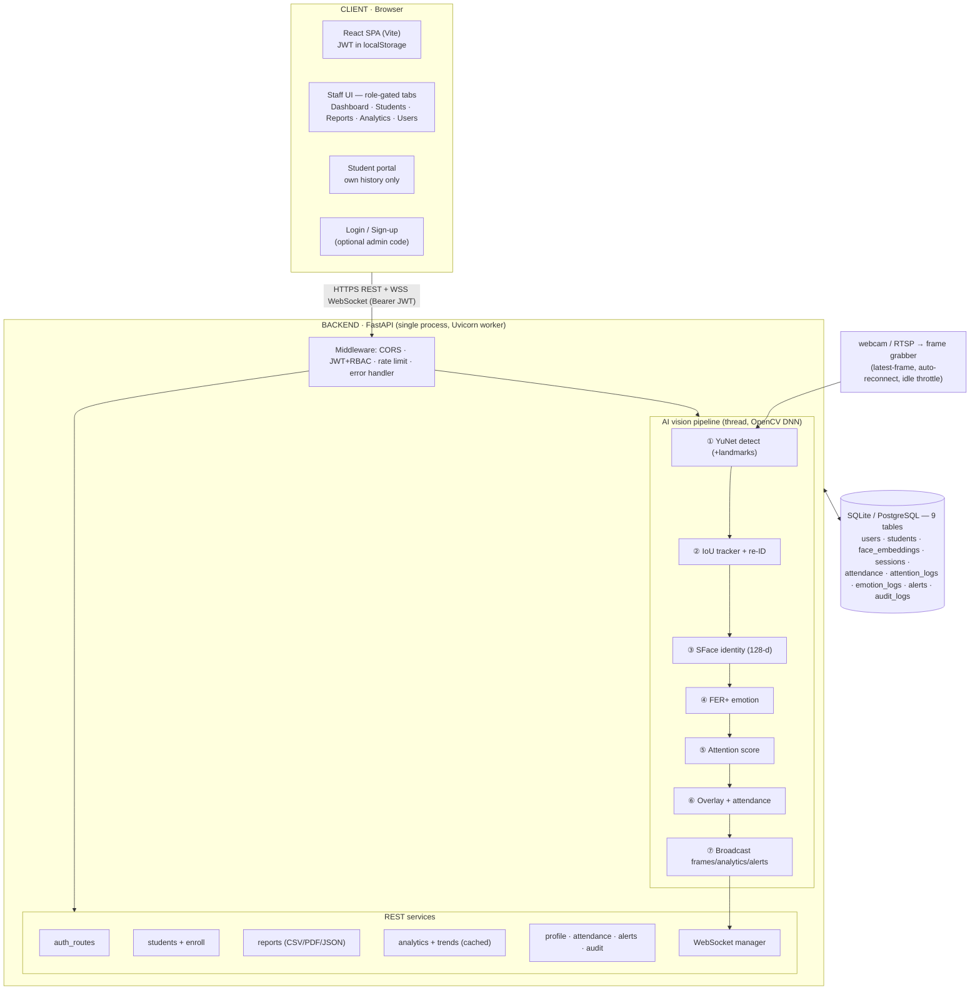

# Architecture

Single-process FastAPI backend serving a React SPA over HTTPS REST + a WebSocket,
backed by SQLite/PostgreSQL, with a background OpenCV vision pipeline.

## Request paths

- **REST** (`Authorization: Bearer <jwt>`): every route carries a role dependency
  (`require_role`). Order: middleware (rate-limit + log) → route → service → DB.
- **WebSocket** (`/live?token=<jwt>`): viewer+ only. The pipeline pushes three
  message types — `frame` (base64 JPEG ~5 fps), `analytics` (~2/s), `alert`
  (immediate), plus `session_ended` on stop.

## Pipeline timing

- Capture thread holds only the latest frame (frame skipping).
- CV work runs in a thread-pool executor so the event loop is never blocked.
- After ~50 empty frames, detection drops to every 3rd frame (idle throttle);
  the feed keeps streaming.
- DB flush of attention/emotion samples every 10 s; analytics endpoints are
  TTL-cached (5 s) and trends cached (30 s).

## Identity resolution

Each unresolved track accumulates ≥5 SFace embeddings; the mean is matched
against per-student galleries (cosine). ≥0.40 = match (similarity reported as
confidence), <0.25 = register new student, in-between = held as "identifying"
so ambiguity never spawns a duplicate. Galleries persist across restarts.
